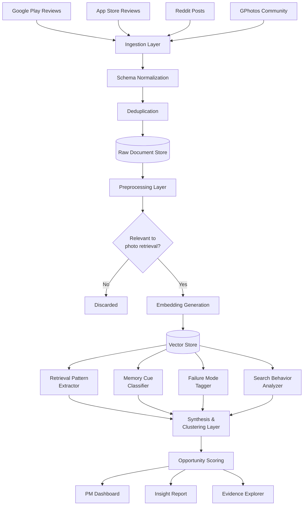

# Architecture: AI-Powered Photo Retrieval Discovery Engine

## Overview

This document describes the end-to-end architecture of an AI-powered discovery engine built to analyze user feedback about photo retrieval at scale. The system ingests raw user conversations and reviews from multiple platforms, applies multi-layer NLP and LLM-based reasoning, and outputs structured insights that help a Product Manager identify high-signal retrieval pain points and opportunity areas.

---

## System Design Principles

| Principle | Rationale |
|---|---|
| Discovery-first, not search-first | The goal is surfacing unknown patterns, not querying known ones |
| Evidence-grounded | Every insight must trace back to real user quotes |
| Beyond sentiment | Move from "users are frustrated" → "users forget temporal context most often" |
| Composable pipeline | Each layer is independently replaceable and testable |
| PM-ready output | Final artifacts must be consumable without engineering context |

---

## High-Level Architecture

```
┌─────────────────────────────────────────────────────────────────┐
│                        DATA SOURCES                             │
│  Google Play Reviews │ App Store Reviews │ Reddit │ GPhotos     │
│                      Community/Support Forum                     │
└────────────────────────────┬────────────────────────────────────┘
                             │
                             ▼
┌─────────────────────────────────────────────────────────────────┐
│                    INGESTION LAYER                               │
│  Scrapers / APIs → Deduplication → Schema Normalization         │
└────────────────────────────┬────────────────────────────────────┘
                             │
                             ▼
┌─────────────────────────────────────────────────────────────────┐
│                  PREPROCESSING LAYER                            │
│  Language Detection → Noise Filtering → Chunking → Embedding    │
└────────────────────────────┬────────────────────────────────────┘
                             │
                             ▼
┌─────────────────────────────────────────────────────────────────┐
│                   AI ANALYSIS LAYER                             │
│  Retrieval Pattern Extractor │ Memory Cue Classifier            │
│  Failure Mode Tagger │ Search Behavior Analyzer                 │
└────────────────────────────┬────────────────────────────────────┘
                             │
                             ▼
┌─────────────────────────────────────────────────────────────────┐
│                  SYNTHESIS & CLUSTERING LAYER                   │
│  Thematic Clustering → Opportunity Scoring → Evidence Linking   │
└────────────────────────────┬────────────────────────────────────┘
                             │
                             ▼
┌─────────────────────────────────────────────────────────────────┐
│                     OUTPUT LAYER                                │
│  PM Dashboard │ Insight Reports │ Raw Evidence Explorer         │
└─────────────────────────────────────────────────────────────────┘
```

---

## Layer-by-Layer Breakdown

### 1. Data Sources

| Source | Data Type | Access Method | Volume Estimate |
|---|---|---|---|
| Google Play Store | Star ratings + text reviews | google-play-scraper library / SerpAPI | 10K–100K reviews |
| Apple App Store | Star ratings + text reviews | app-store-scraper / iTunes Search API | 10K–50K reviews |
| Reddit | Threads + comments | Reddit API (PRAW) | 5K–30K posts |
| Google Photos Community | Support threads + Q&A | Web scraping (BeautifulSoup / Playwright) | 2K–10K threads |

---

### 2. Ingestion Layer

**Responsibilities:**
- Pull raw data from each source on a scheduled or on-demand basis
- Normalize into a common schema
- Deduplicate across sources

**Common Schema (per document):**

```json
{
  "id": "uuid",
  "source": "play_store | app_store | reddit | community",
  "text": "raw user text",
  "rating": 1–5 | null,
  "date": "ISO 8601",
  "url": "source URL",
  "metadata": {
    "upvotes": 0,
    "reply_count": 0,
    "is_thread_starter": true
  }
}
```

**Key Components:**
- `SourceConnector` – one per data source, handles auth, rate limits, pagination
- `Deduplicator` – MinHash or SimHash to detect near-duplicate reviews
- `SchemaMapper` – maps source-specific fields to the common schema
- `DataStore` – raw document store (e.g., PostgreSQL or BigQuery)

---

### 3. Preprocessing Layer

**Responsibilities:**
- Filter noise (spam, off-topic, non-English if scoped)
- Detect language and optionally translate
- Chunk long documents into meaningful segments
- Generate vector embeddings for semantic search and clustering

**Steps:**

```
Raw Text
   │
   ├── Language Detection (langdetect / fastText)
   ├── Noise Filter (regex rules + classifier for spam/irrelevant)
   ├── Text Normalization (lowercase, remove emojis, fix encoding)
   ├── Relevance Filter (is the text about photo retrieval/search?)
   ├── Chunking (sentence or paragraph level)
   └── Embedding Generation (text-embedding-3-large or similar)
```

**Relevance Filter Logic:**
- Keyword signal: "search", "find", "can't find", "remember", "lost photo", "looking for"
- LLM-based binary classifier: *"Is this review about difficulty finding/retrieving a photo?"*

---

### 4. AI Analysis Layer

This is the core intelligence of the system. Four specialized analyzers run on each relevant document chunk.

---

#### 4a. Retrieval Pattern Extractor

**Goal:** What type of photo/memory is the user trying to retrieve?

**Output tags (examples):**
- `event_based` – "photo from my wedding"
- `person_based` – "photo with my mom"
- `location_based` – "photos from Goa"
- `object_based` – "photo of a medicine bottle"
- `time_based` – "photo from last year"
- `emotion_based` – "that funny photo we took"

**Implementation:** Few-shot LLM prompt with structured JSON output + taxonomy validation

---

#### 4b. Memory Cue Classifier

**Goal:** What contextual details does the user *remember* vs. *forget*?

| Memory Dimension | Remembered (examples) | Forgotten (examples) |
|---|---|---|
| Time | "last summer", "when I was sick" | Exact date, year |
| Location | "Goa", "that café" | Specific address, coordinates |
| People | "with my friend" | Their name, face |
| Object/Subject | "medicine bottle", "blue dress" | Product name, brand |
| Album/Folder | — | Album name, folder |
| Context/Emotion | "that funny moment" | What triggered it |

**Implementation:** Structured extraction prompt → outputs `{remembered: [...], forgotten: [...]}` per review

---

#### 4c. Failure Mode Tagger

**Goal:** Where exactly does the current Google Photos retrieval experience break down?

**Taxonomy of Failure Modes:**

```
FAILURE MODES
├── Search Vocabulary Mismatch
│     └── User uses natural language; system needs exact keywords
├── Temporal Ambiguity
│     └── User remembers "last year" but not exact date
├── Location Imprecision
│     └── User knows general region, not GPS-exact location
├── No Album / Unorganized Library
│     └── Photo was never sorted; user has no organizational anchor
├── Visual-Only Memory
│     └── User remembers how it looks but has no searchable text
├── Search UX Breakdown
│     └── Filters too complex, results unclear, no refinement
└── Wrong Confidence Signal
      └── User searched but gave up assuming it was deleted
```

---

#### 4d. Search Behavior Analyzer

**Goal:** How do users currently attempt retrieval when memory is incomplete?

**Behaviors detected:**
- Approximate date browsing ("scrolled through months of photos")
- Keyword guessing ("tried different search terms")
- Album scanning
- Asking others ("sent the photo to someone, asked them to find it")
- Gave up / assumed deleted
- Used third-party tools / Google search instead

---

### 5. Synthesis & Clustering Layer

**Responsibilities:**
- Cluster semantically similar pain points across documents
- Score opportunity areas by volume, severity, and uniqueness
- Link every cluster back to raw evidence (user quotes)

**Steps:**

```
Embeddings
   │
   ├── Dimensionality Reduction (UMAP → 2D/3D)
   ├── Clustering (HDBSCAN or k-means)
   ├── Cluster Labeling (LLM summarizes top-N docs per cluster)
   ├── Opportunity Scoring
   │     ├── Volume Score   – number of unique users affected
   │     ├── Severity Score – proportion of 1–2 star reviews
   │     └── Novelty Score  – not addressed by current features
   └── Evidence Linker – maps each cluster → top 5 verbatim quotes
```

**Opportunity Score Formula:**

```
Opportunity Score = (Volume × 0.4) + (Severity × 0.4) + (Novelty × 0.2)
```

---

### 6. Output Layer

**Three consumer-facing artifacts:**

#### 6a. PM Insight Dashboard
- Interactive table of opportunity areas ranked by score
- Click-through to supporting user quotes per cluster
- Filters by source, rating, date range, failure mode

#### 6b. Structured Insight Report
- Auto-generated markdown/PDF report per opportunity area
- Sections: Summary → Evidence → User Memory Profile → Failure Mode → Opportunity Statement

#### 6c. Raw Evidence Explorer
- Semantic search over all ingested documents
- Filter by tag (e.g., show me all `location_based` + `temporal_ambiguity` reviews)

---

## Data Flow Diagram



---

## Technology Stack

| Component | Technology Options |
|---|---|
| Data Scraping | Python + PRAW, google-play-scraper, Playwright |
| Data Storage | PostgreSQL (structured) + S3/GCS (raw) |
| Vector Store | Pinecone / Weaviate / pgvector |
| Embeddings | OpenAI text-embedding-3-large / Gemini embedding |
| LLM Analysis | GPT-4o / Gemini 1.5 Pro (structured JSON output) |
| Clustering | UMAP + HDBSCAN (scikit-learn / umap-learn) |
| Orchestration | Apache Airflow / Prefect |
| Dashboard | Streamlit / Observable / Retool |
| Report Generation | Python + Jinja2 → Markdown/PDF |

---

## Key Design Decisions

### Why LLM-based tagging over rule-based NLP?
User language around photo retrieval is highly varied and colloquial. Rule-based systems miss paraphrases. LLMs with few-shot prompting generalize far better across the long tail of expressions.

### Why semantic clustering over keyword grouping?
"I can't find the beach photo" and "my seaside vacation pictures are gone" describe the same problem but share no keywords. Embedding-based clustering captures semantic equivalence.

### Why evidence linking is mandatory?
PM decisions at Google require defensible, user-grounded rationale. Every insight must be traceable to verbatim user quotes to withstand stakeholder scrutiny.

---

## Open Questions / Future Enhancements

- [ ] Expand to non-English reviews (multilingual embedding models)
- [ ] Integrate quantitative usage data (search abandonment rates) alongside qualitative signals
- [ ] Add longitudinal tracking — do pain points shift over time with product releases?
- [ ] Fine-tune a classifier on Google Photos-specific taxonomy for higher precision
- [ ] Build a feedback loop: PM annotates clusters → model improves labeling
